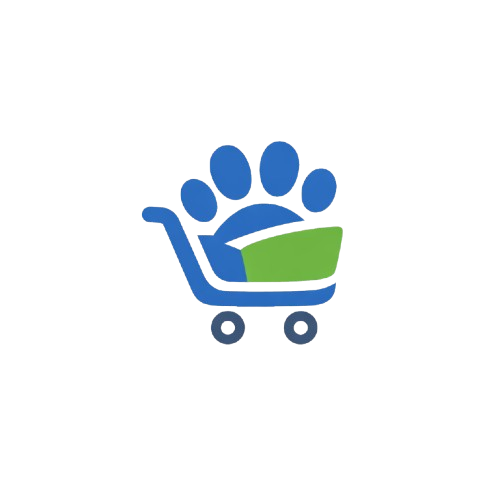

## PetZone



Todo lo que tu Mascota Necesita en un Solo Lugar

## Descripción del Proyecto

PetZone es una plataforma de comercio electrónico especializada en la venta de productos para mascotas. Nuestra misión es ofrecer a los dueños de mascotas una experiencia de compra segura, intuitiva y accesible desde cualquier dispositivo, garantizando productos de alta calidad para el cuidado y bienestar animal.

La aplicación cuenta con un catálogo completo de productos organizados por categorías, permitiendo a los usuarios explorar, buscar y adquirir artículos de manera eficiente. Además, incorpora un sistema de carrito de compras, pagos seguros y seguimiento de pedidos en tiempo real para brindar una experiencia confiable y satisfactoria.

## Misión

Brindar a los dueños de mascotas acceso fácil, rápido y seguro a productos de alta calidad, mejorando el bienestar animal a través de una plataforma digital eficiente, confiable y disponible 24/7.

## Visión

Ser la tienda en línea líder en productos para mascotas, reconocida por su variedad, calidad y excelente experiencia de compra, transformando la manera en que las personas adquieren artículos para el cuidado y felicidad de sus mascotas.

## Nuestros Valores

Calidad Garantizada: Ofrecemos productos seleccionados bajo altos estándares para asegurar la salud y el bienestar de las mascotas.

Confianza: Garantizamos pagos seguros, transparencia en los procesos y protección de datos.

Compromiso con el Bienestar Animal: Cada producto está pensado para mejorar la calidad de vida de las mascotas.

Responsabilidad: Actuamos con ética, profesionalismo y atención al cliente de excelencia.

---

## Integrantes del Equipo

| Nombre | Rol |
|--------|-----|
| Luis Guillermo Alvarado Arias | Desarrollador |
| Jose David Elizondo Romero | Desarrollador |
| Francis Aitana Sanchez Hernandez | Desarrollador |

---

## Paleta de Colores

| Color | Código | Uso |
|-------|--------|-----|
| Azul Principal | `#3b6ed7` | Botones y elementos principales |
| Verde Destacado | `#59c461` | Estados positivos y confirmación |
| Gris Claro | `#eceff1` | Fondos y espacios en blanco |
| Azul Grisáceo | `#37474f` | Textos y bordes |

---

## Tecnologías Utilizadas

- **Frontend**: HTML5, CSS3, JavaScript (Vanilla)
- **CSS Framework**: Bootstrap 5.3.3
- **Preprocesador CSS**: Sass
- **Librerías**: 
  - Font Awesome (iconos)
  - SweetAlert2 (alertas y notificaciones)
- **Responsive Design**: Mobile-first approach
- **Versionamiento**: Git & GitHub
- **Desarrollo**: Visual Studio Code

---

## Instalación y Uso

### Requisitos Previos:
- Node.js (v14 o superior)
- npm (viene incluido con Node.js)
- Navegador web moderno (Chrome, Firefox, Edge, Safari)
- Conexión a Internet (para CDNs de Bootstrap, Font Awesome y SweetAlert2)

### Pasos para ejecutar:

1. **Clonar el repositorio**
   ```bash
   git clone https://github.com/lalvarado05/PetZone.git
   cd PetZone
   ```

2. **Instalar dependencias**
   ```bash
   npm install
   ```
   Esto instalará:
   - Sass (preprocesador CSS)
   - Bootstrap (framework CSS)

3. **Compilar los estilos SASS**
   
   Para compilar una vez:
   ```bash
   npm run sass:build
   ```
   
   Para compilar automáticamente al guardar cambios:
   ```bash
   npm run sass:watch
   ```

4. **Abrir la aplicación**
   - Opción 1: Abrir `index.html` directamente en el navegador
   - Opción 2: Usar un servidor local (recomendado):
     ```bash
     # Con Python 3
     python -m http.server 8000
     
     # O con Node.js (si tienes http-server instalado)
     npx http-server
     ```
     Luego acceder a `http://localhost:8000`


### Scripts Disponibles

- `npm run sass:build` - Compila SASS a CSS una vez
- `npm run sass:watch` - Compila SASS automáticamente al detectar cambios

---

## Licencia

Este proyecto está desarrollado como parte del curso **Programación Web Avanzada** del **CENFOTEC**.
Todos los derechos reservados © 2026 PetZone

---

## Entrega del Proyecto

**Primera Entrega - Objetivos Completados:**
- ✅ Definición de la empresa (nombre, misión, visión, valores)
- ✅ Landing page funcional
- ✅ Prototipo de interfaz responsive
- ✅ Estructura base de la aplicación web

---

**Segunda Entrega - Objetivos Completados:**
- Pendiente

**Versión**: 1.1
**Última actualización**: Marzon 8, 2026

---

¡Gracias por visitar PetZone! 🐾
